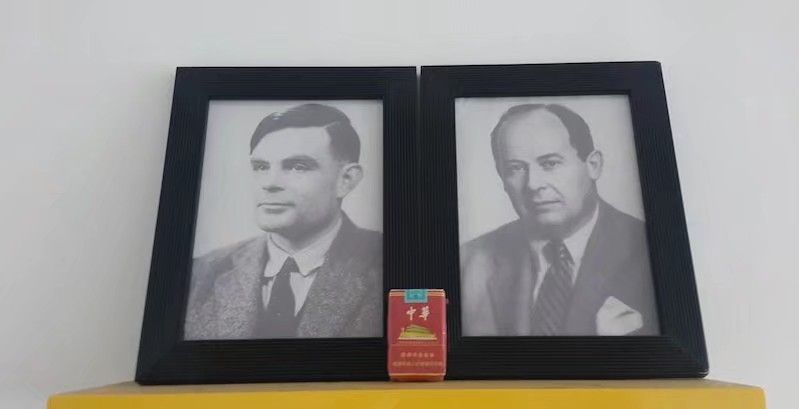

### Hi! I'm Tan YaoDan.👋You had me at Hello.

### 🧑 About Me
- 😎 I'm a Senior Undergraduate.
- ⚙️ I use daily: C++, Python, PHP, Node.
- 💬 Languages: **C++**, **Python**, **Bash**.
- 💜 Hobbies: **Soccer**, **Music**, **Iced Caffè Americano**.

### 🎓 Github Stats

### 🙏 Von Neumann and Turing bless me please.
### 🏆 Most Used Languages

